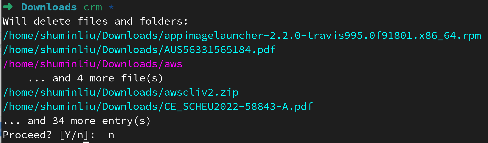
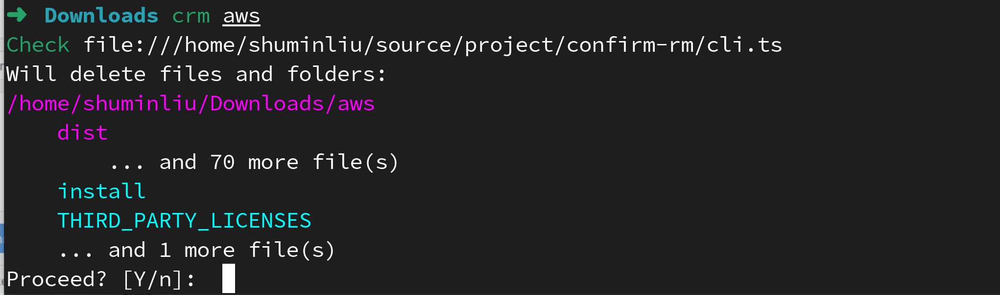

# confirm-rm

A safer rm with confirmation!

 

## install

### Pre-build binary

Download latest pre-build binary via
[release](https://github.com/Liu233w/confirm-rm/releases)

### Install via Deno

```shell
# Change version by your need
VERSION=v0.2.0
# install using Deno
deno install --import-map "https://deno.land/x/confirm_rm@$VERSION/import_map.json" --allow-read --allow-write "https://deno.land/x/confirm_rm@$VERSION/cli.ts"
# set alias
alias crm='confirm_rm'
```
